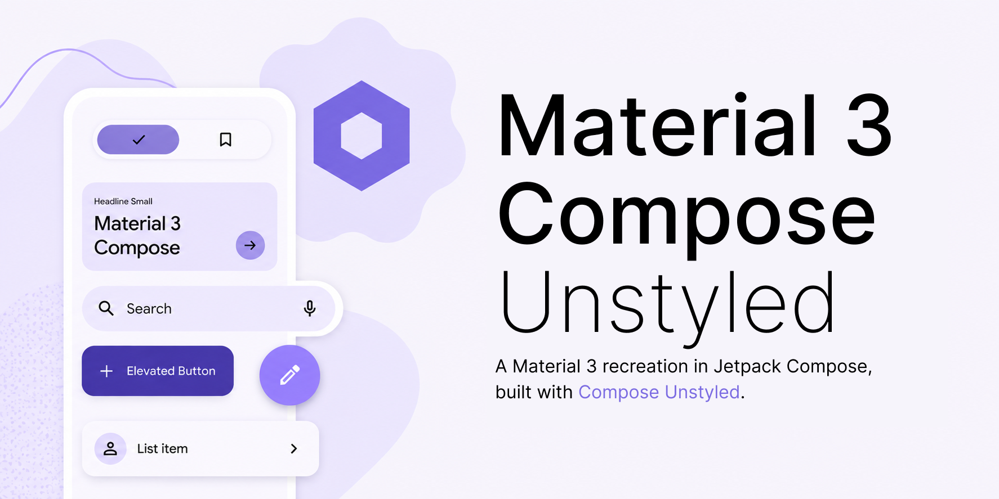

# Material 3 Compose Unstyled



An example of how to create your own components with [Compose Unstyled](https://github.com/composablehorizons/compose-unstyled) in an existing Material 3 Compose project. The components still use `MaterialTheme` for theming, so they fit into a normal Material 3 Compose app while moving behavior and accessibility to Compose Unstyled primitives.

The difference from Material 3 Compose is that these implementations follow the Material 3 specs without Android's platform constraints. All components also follow the [W3C ARIA specs](http://w3.org/WAI/ARIA/apg/patterns) for accessibility.

## Components

- Alert dialog
- Buttons
- Checkbox
- Dividers
- Dropdown menu
- Floating action buttons
- Icon buttons
- Linear progress indicator
- Modal bottom sheet
- Outlined text field
- Primary tab row
- Radio button
- Secondary tab row
- Slider
- Switch
- Text field
- Tooltip
- Tri-state checkbox

## Run

Run the desktop demo:

```bash
./scripts/runJvm
```

Run the Android demo on a connected device or emulator:

```bash
./scripts/runAndroid
```
